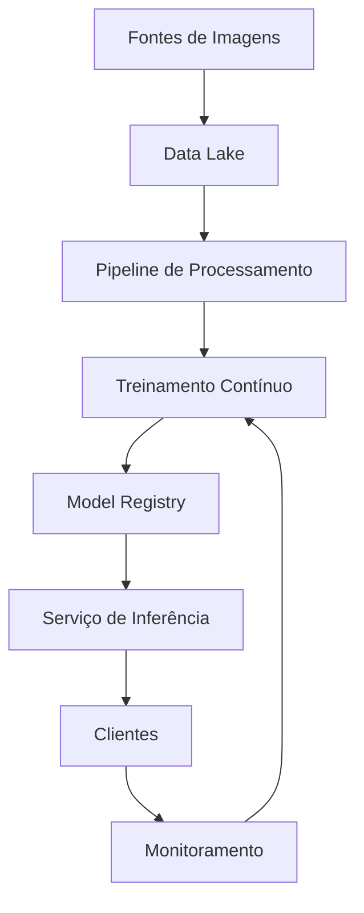

# Arquitetura de Produção Escalável para Classificador Cavalo vs. Pessoa

## Visão Geral da Arquitetura

A arquitetura proposta escala o classificador binário original para um ambiente de produção empresarial, mantendo a eficiência do modelo MobileNetV2 enquanto adiciona capacidades para:

- Processamento de milhares de imagens/segundo
- Integração com múltiplas fontes de dados
- Expansão para classificação multi-classe
- Atualização contínua do modelo

## Componentes Principais

### 1. Coleta e Armazenamento

**Data Lake (S3/Azure Blob)**  
Armazena imagens brutas e metadados, mantendo flexibilidade para reprocessamento futuro. Preserva os dados originais enquanto o modelo opera com imagens redimensionadas para 224x224 pixels.

**Sistema de Mensagens (Kafka/Kinesis)**  
Gerencia fluxos contínuos de imagens em tempo real, essencial para cenários com múltiplas fontes simultâneas como câmeras de segurança.

### 2. Processamento de Dados

**Pipeline Distribuído (Spark+TFData)**  
Executa transformações consistentes com o treinamento original:
- Redimensionamento para 224x224
- Normalização (pixel/255)
- Cache em formato TFRecords

**Feature Store (Hopsworks/Feast)**  
Armazena embeddings pré-calculados para acelerar futuros treinamentos quando novas classes forem adicionadas.

### 3. Ciclo de Vida do Modelo

**MLflow + TFX**  
Gerencia experimentos e automatiza pipelines de retreinamento, garantindo reprodutibilidade.

**Active Learning**  
Seleciona automaticamente amostras complexas para validação humana, otimizando custos de labeling.

### 4. Serviço de Inferência

**Triton Inference Server**  
Oferece:
- Execução otimizada em GPU
- Autoescalonamento
- Suporte a múltiplos modelos

**Sistema de Cache (Redis)**  
Armazena resultados para consultas repetidas, reduzindo carga computacional.

### 5. Monitoramento

**Data Drift (Evidently)**  
Detecta mudanças na distribuição dos dados de entrada.

**Dashboard Operacional**  
Consolida métricas críticas:
- Latência
- Acurácia
- Utilização de recursos

### 6. Segurança e Governança

**Autenticação e Autorização (OAuth2/OIDC)**  
Implementa controle de acesso granular via tokens JWT, garantindo que apenas usuários e sistemas autorizados possam acessar endpoints de inferência e dados sensíveis. Integra-se com provedores de identidade corporativos.

**Criptografia de Dados**  
Aplica:  
- Criptografia em trânsito (TLS 1.3 para todas as comunicações)  
- Criptografia em repouso (AES-256 no Data Lake e Feature Store)  
- Gerenciamento centralizado de chaves via AWS KMS/Azure Key Vault (ou qualquer outra ferramente de Cloud Computing)

**Monitoramento de Segurança**  
- Detecção de anomalias em padrões de acesso (SIEM integrado)  
- Scans contínuos de vulnerabilidades em containers e dependências  
- Logs de auditoria imutáveis para rastreabilidade completa

## Expansão para Multi-Classe

A arquitetura suporta inclusão de novas categorias através de:

1. Adaptação do modelo:
   - Substituição da camada final
   - Ajuste da função de perda

2. Processamento adaptado:
   - Balanceamento automático de classes
   - Avaliação por métricas específicas

3. Infraestrutura inalterada:
   - Mesmo pipeline de dados
   - Mesmo serviço de inferência

## Diagrama de Arquitetura

O diagrama foi projetado para refletir o fluxo completo de classificação de imagens em ambiente de produção, desde a ingestão de dados até o monitoramento contínuo. Sua estrutura em camadas separadas (coleta, processamento, inferência e feedback) permite escalar cada componente de forma independente, enquanto as conexões entre módulos garantem um ciclo fechado de melhoria contínua. A escolha por componentes especializados em cada etapa (como Kafka para streams e Triton para inferência) otimiza o desempenho sem sacrificar a flexibilidade para expansão futura, mantendo coerência com a arquitetura inicial do classificador binário.

## Considerações Finais

A arquitetura mantém as vantagens do classificador original enquanto adiciona capacidades profissionais necessárias para:
- Alta disponibilidade (99.99% SLA)
- Baixa latência (<500ms p95)
- Evolução contínua do modelo
- Expansão controlada de custos
